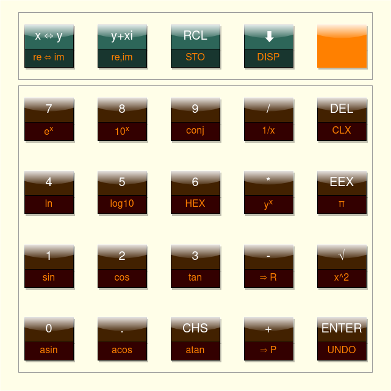
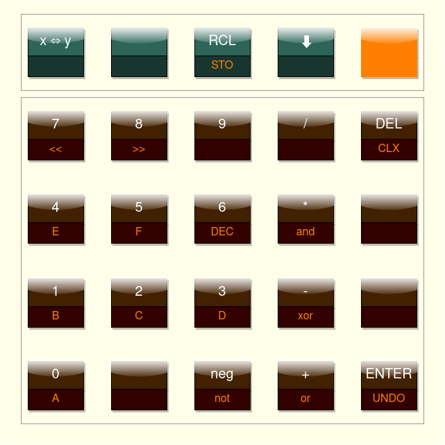

# rpn2026
An RPN firmware for the [EL-210-MOD](https://github.com/suikan4github/EL-210-MOD/tree/develop) board. 
## Description
This firmware is designed run on the [EL-210-MOD](https://github.com/suikan4github/EL-210-MOD/tree/develop) board. With that board, this firmware makes SHARP EL-210/EL-215 pocket calculator as RPN an calculator.

The main futures of this calculator firmware are : 
- 4 depth stack RPN calculator.
- 9.9999999E99 ... 1.000000E-99
- FUNC key extend the key function.
- Transcendental functions ( sin/cos/tan/ex/ln/power,...).
- Complex functions ( conjugate/to polar/to rectangular).
- Hex mode.
- Scientific input method with EEX key.
- Fixed point / Scientific / Engineering display mode.
- Store to / Recall from a user variable. 
- Undo.
- 2 keys roll over. 

The following figure depicts the key map of the normal mode. The orange key is the FUNC key. 



The following figure depicts the key map of the HEX mode. The orange key is the FUNC key. 


## Environment
- Ubuntu 22.04
- CubeIDE 1.10.1
## Build and Download

```
git clone https://github.com/suikan4github/rpn2026.git --recursive

```

Then, import the firmware project into CubeIDE. Finally, you can build the firmware. 

You can download the firmware from CubeIDE by download command. Refer [EL-210-MOD](https://github.com/suikan4github/EL-210-MOD/tree/develop) schematics to understand the connection of the LI2026ODP and JTAG emulator. 

## License
This software is licensed by the [MIT license](LICENSE.md). 